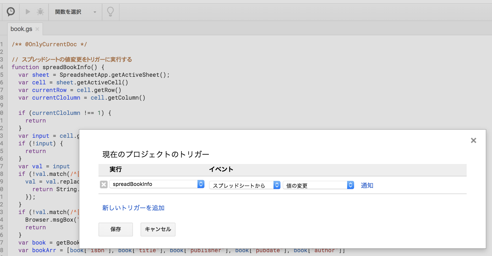

# 概要
スプレッドシートにISBNを入力して書籍情報を展開するためのGoogle Apps Scriptです。

# 準備
1. Google Apps Script用の[Chrome拡張](https://chrome.google.com/webstore/detail/google-apps-script/eoieeedlomnegifmaghhjnghhmcldobl?hl=ja)を追加します。

2. スプレッドシートを新規作成し、**ツール** -> **スクリプトエディタ** を選択します。

3. `book.gs` の中身をコピー&ペーストします。

4. タイマーマークをクリックして、つぎのようにスプレッドシートの値変更で関数を実行できるように設定します。

# 使い方
A列にISBNを入力すると、B列以降に書籍情報が展開されます。

バーコードリーダーを使うと便利です。

